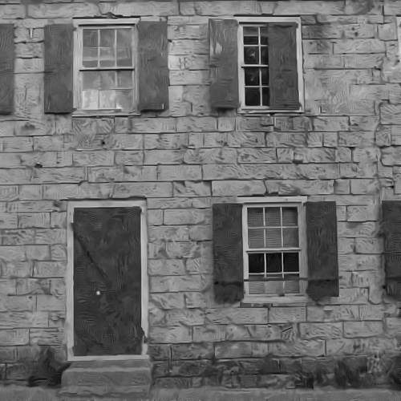
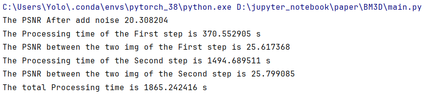

# 传统降噪算法——BM3D论文复现(learning)

## 一、论文原理

BM3D算法的核心思想是将图像分成多个重叠的块，并利用图像块之间的相似性来去除噪声。算法主要包括以下步骤：

- 相似块匹配： 将待去噪图像分成大小相同的块，并根据块之间的相似性进行匹配，将具有相似特征的块进行分组，形成一个三维数据块。

- 3D 变换： 对每个三维数据块进行 3D 变换，例如离散余弦变换 (DCT) 或小波变换，将图像数据变换到频域。

- 非线性阈值处理： 根据噪声统计特性和图像特征，在变换域中对各个频域系数进行非线性阈值处理，去除噪声成分。

- 3D 逆变换： 对处理后的频域系数进行 3D 逆变换，得到去噪后的三维数据块。

- 块重构： 将每个三维数据块的去噪结果合并到原始图像，得到最终的去噪图像。
  

**由于原论文数学公式比较复杂，具体细致内容还在学习。**

##  二、论文评价

- BM3D算法的优势：

​		- 高效去噪性能： BM3D算法能够有效去除高斯噪声和其他类型的噪声，去噪效果显著。

​		- 保留图像细节： 与其他去噪算法相比，BM3D算法能够更好地保留图像的边缘和纹理细节。

​		- 抗噪性强： BM3D算法对不同类型的噪声具有较强的抗噪能力，适用于各种噪声环境。

- BM3D算法的不足：

​	- 计算量大： 相对于其他算法，BM3D算法的计算量较大，需要较长的处理时间。

	- 参数选择： BM3D算法涉及多个参数，例如块大小、搜索范围等，参数的选择对去噪效果有较大影响。

## 三、论文复现

在项目文件中的`main.py` 中为BM3D主要算法的实现，代码主要参考了原论文和相关博客的代码解读。

### 1.单张图像复现效果

项目使用Kodak24数据集中的首张图片来进行降噪，每step进行PSNR输出。

原图像为：

加入σ = 25的高斯噪声后的噪声图像为：

#### step1  输出图像PSNR = 25.617   耗时为 1494s

#### step2  输出图像PSNR = 25.799   耗时为 1865s

​	一张500X500的图像需要降噪时间为**31分钟左右！**

​	对比两张step图像,step2图像相比step1更加具有细节和砖石的波纹，纹理和边缘更加清晰，然而砖石的纹理存在失真和扭曲，说明需要根据实际效果再对算法参数进行调整。

> 参数选择： BM3D算法涉及多个参数，例如块大小、搜索范围等，参数的选择对去噪效果有较大影响。

​	总结：

​	

### 2.数据集复现效果

​	算力需求较大，时间较长，后续将更新结果。